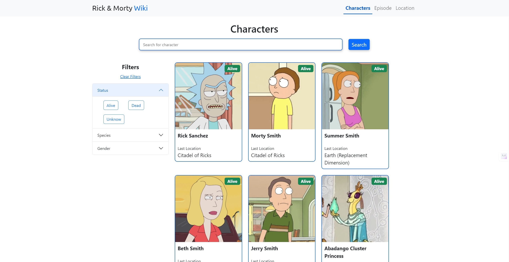
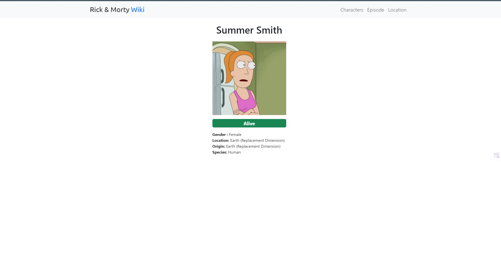
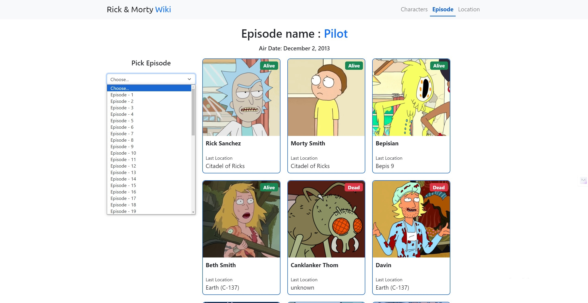
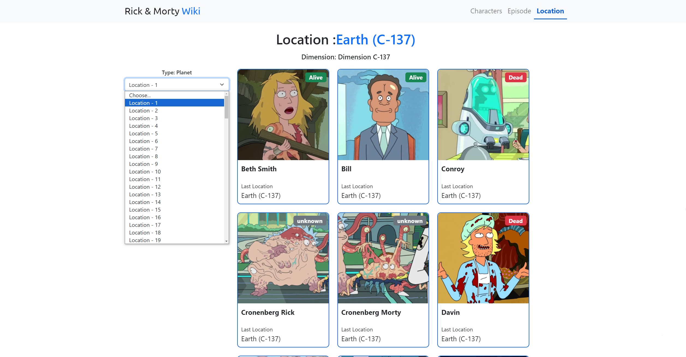

# Rick&Morty - WikiApp


Este proyecto es una aplicación web desarrollada en ReactJS que consume la API de Rick & Morty para mostrar información sobre los personajes de la serie. Los usuarios pueden explorar información detallada sobre cada personaje, incluyendo su estado vital, género, ubicación, origen y especie. Además, la aplicación permite buscar personajes por diferentes criterios, como nombre, localización, características y episodio. Al hacer clic en cada tarjeta de personaje, los usuarios son redirigidos a una página detallada que muestra la foto y datos específicos del personaje.


# Índice

1. [Tecnologías utilizadas](#tecnologías-utilizadas)
2. [Características](#características)
3. [Screenshots](#screenshots)
4. [Instalación del proyecto en local](#instalación-del-proyecto-en-local)
5. [Soporte Adicional](#soporte-adicional)


## Tecnologías utilizadas

- ReactJS
- React Router
- HTML5
- CSS3
- JavaScript (ES6+)


## Características

- Visualización de información detallada de los personajes de Rick & Morty.
- Búsqueda de personajes por nombre, localización, características y episodio.
- Navegación intuitiva entre páginas de personajes.
- Diseño responsive para una experiencia óptima en dispositivos móviles y de escritorio.


## Screenshots


*Pantalla de inicio con lista de personajes.*


*Detalle del personaje con información específica.*


*Filtrar personaje por episodio.*


*Filtrar personaje por localización.*

## Instalación del proyecto en local

Para instalar y ejecutar este proyecto en tu entorno local, sigue estos pasos:

1. Clona este repositorio en tu máquina local utilizando Git:

    ```bash
    git clone https://github.com/AlejandroGC1990/react_wiki_rick-morty.git
    ```

2. Accede al directorio del proyecto:

    ```bash
    cd react_wiki_rick-morty
    ```

3. Instala las dependencias utilizando npm:

    ```bash
    npm install
    ```

4. Inicia la aplicación:

    ```bash
    npm start
    ```

5. Abre tu navegador web y accede a [http://localhost:3000](http://localhost:3000) para ver la aplicación en acción.

¡Listo! Ahora deberías tener la aplicación Rick & Morty Character Viewer funcionando en tu entorno local. Disfruta explorando los personajes de esta divertida serie animada.
## Soporte adicional

Si encuentras algún problema durante la instalación o configuración, por favor, ponte en contacto conmigo a través de "alejandrogc.dev@gmail.com" para obtener ayuda adicional.